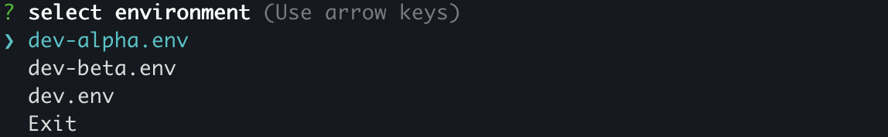
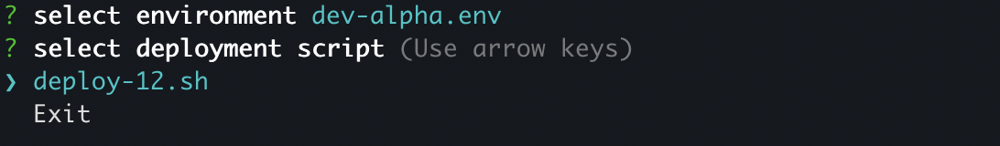

## deploykit 

<blockquote>
The script needs two variables from the env "ENV_DIR" & "DEPLOY_DIR"
I would recommend that you add something like:
export ENV_DIR=/path/to/directories-with-env-files
export DEPLOY_DIR=/path/to/directories-with-deploy-scripts
Also ensure that these directories <b>only have files</b>
</blockquote>

### Installation

`npm i -g @kartikkhk/deploykit`

### Usage

- Just install deploykit and run `deploy`

### Example Screenshots

  

- **LICENSE**: [WTFPL](http://www.wtfpl.net/)
